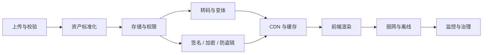
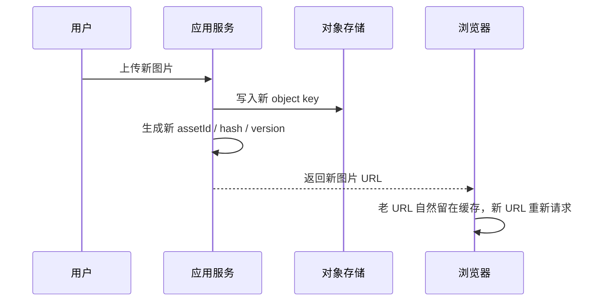
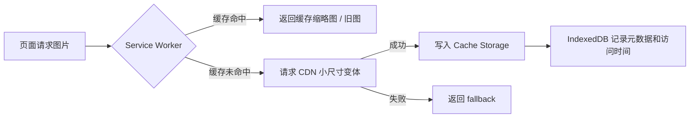

# SaaS 图片治理全景方案：性能、缓存、弱网、安全与成本的一体化设计


SaaS 产品里的图片，往往不是一个“压缩一下就好”的问题。

一个真实业务系统里，图片会出现在首页推荐流、内容卡片、头像、背景图、评论区、运营 Banner、视频封面、私密相册、付费内容、编辑器预览和分享卡片里。它们的访问频率、权限要求、展示尺寸、缓存周期、安全边界都不一样。如果所有图片都套同一套上传、存储和展示策略，最后常见的问题是：首屏慢、列表抖、弱网空白、CDN 成本高、私密图泄露、缓存失效混乱、防盗链误伤正常用户。

更合理的思路，是把图片当成一条完整链路来治理：



这篇文章给出一套面向 SaaS 多图场景的完整治理方案，覆盖性能、缓存、弱网、加密、防盗链、权限、离线、可访问性、SEO、审核、成本和落地路线图。

## 一、先分层：图片不是一种资源

图片治理最容易失败的地方，是一开始没有分场景。

至少应该把图片拆成五类：

| 类型 | 示例 | 核心目标 | 推荐策略 |
|---|---|---|---|
| 公共静态图 | Logo、默认头像、空状态、图标 | 稳定、长缓存、无权限 | 构建产物或公共 CDN，文件名 hash，长期缓存 |
| 公开业务图 | 内容封面、推荐卡片、视频 poster | 快速加载、低成本、高命中率 | CDN 变体、AVIF/WebP、响应式尺寸、懒加载 |
| 用户上传图 | 头像、背景图、评论图、动态图片 | 质量可控、防大图拖垮链路 | 上传校验、裁剪、压缩、服务端转码 |
| 半公开图 | 登录后图片、会员区缩略图 | 有权限边界，但仍要可缓存 | 短期签名 URL 或签名 Cookie，按权限出变体 |
| 私密 / 付费图 | 私密相册、付费原图、敏感资料图 | 防泄露优先 | 服务端鉴权、最小下发、签名访问、必要时加密 |

这张表决定后面的所有策略。公开封面和私密原图不应该共用同一种 URL 规则；头像和长图详情页也不应该共用同一个尺寸变体；运营图和用户上传图更不应该走同一套审核与缓存流程。

## 二、上传层：别让原图直接进入展示链路

上传层要解决四件事：可信输入、尺寸控制、资产标准化、可追溯。

**客户端先做体验型校验。** 文件类型、扩展名、MIME、大小上限都应该在客户端先拦一次。头像、背景图、评论图这类场景，还应该尽早进入裁剪流程，让用户提交的就是业务需要的比例，而不是把十几 MB 的原始相册图直接传上去。

但客户端校验不能作为安全边界。服务端必须重新校验 MIME、文件头、尺寸、大小、像素总量，并阻断伪装成图片的脚本、超大像素图片和异常格式。

**上传后生成标准资产。** 不要把原图直接作为业务展示图。更稳的资产模型是：

| 资产 | 用途 |
|---|---|
| `original` | 原始文件，仅用于审核、重新转码、归档或授权下载 |
| `display` | 主要展示图，通常转成 WebP / AVIF，并限制最长边 |
| `thumbnail` | 列表、卡片、预览场景 |
| `placeholder` | 低清占位、主色占位或 blur 占位 |
| `metadata` | 宽高、大小、hash、主色、格式、审核状态、访问级别 |

对头像、封面、详情大图、横版 Banner、竖版海报，要建立固定尺寸档位。不要让每个页面临时猜应该请求多大的图。

**上传链路要适配弱网。** 用户上传图片时，网络中断、切后台、文件过大、多图并发都会影响成功率。上传体验至少应该支持：上传前压缩和裁剪、进度条、取消、失败重试、多图排队、分片或断点续传、本地预览、服务端转码中的处理中状态。

**图片必须可追溯。** 每张图至少要有资产 ID、归属用户、业务类型、原始 MIME、宽高、大小、hash、审核状态、访问级别和创建时间。后续做清理、风控、版权处理、成本分析，都依赖这份元数据。

## 三、存储与分发：公开图和私密图从根上分开

存储层建议从一开始就按访问级别规划。

公开图片可以放在公共读的对象存储路径后面，再由 CDN 分发。它们依赖的是缓存命中和文件名不可变。

私密或付费图片不要用“猜不出来的长 URL”当权限。长 URL 只能降低被扫到的概率，不能代表授权。更稳的方式是：

- 原图放在私有 bucket 或私有路径。
- 对象存储默认拒绝公共访问。
- 业务服务根据登录态、会员状态、订单状态签发短期访问凭证。
- CDN 只接受合法签名或签名 Cookie。
- 预览图和完整图分开存储，未解锁时只下发预览图。

对象存储本身也应开启服务端加密。以 S3 为例，官方文档说明新对象默认会进行服务端加密，敏感业务可以进一步使用 KMS 托管密钥。这里的“静态加密”保护的是磁盘和存储侧数据，不等于用户访问鉴权，也不等于防盗链。

分发层的重点是 CDN 变体。推荐建立有限、可控的尺寸变体，而不是允许任意宽高参数：

| 变体 | 用途 | 示例尺寸 |
|---|---|---|
| `avatar-sm` | 评论区、小头像 | 64 x 64 |
| `avatar-lg` | 主页头像 | 160 x 160 |
| `card-cover` | 瀑布流 / 推荐卡 | 360 宽 |
| `feed-cover` | 首屏推荐图 | 640 宽 |
| `detail` | 详情页大图 | 1080 宽 |
| `banner` | 横幅运营图 | 1440 宽 |

Cloudflare Images 支持通过 variants 控制不同场景尺寸；Cloudflare Image Transformations 能在边缘按规则转码和缓存。AWS 体系里可以用对象存储 + CDN + 函数或图片处理服务生成变体。无论供应商是谁，关键原则一样：变体集合要少、命名要稳定、缓存键要可控。

格式上，优先使用 AVIF 和 WebP。但现代格式不是越统一越好：动图、透明图、超大长图、需要保真下载的图片，都可能需要单独策略。

## 四、前端渲染：图片组件承载策略，而不是只包一层 img

多图场景里，前端最重要的不是“全站都用某个组件”，而是这个组件能表达图片策略。

一个成熟的图片组件至少需要支持：

- `kind`：头像、封面、详情图、私密图、运营图等图片类型。
- `priority`：是否首屏关键图片。
- `sizes`：响应式尺寸声明。
- `fallback`：加载失败兜底。
- `aspectRatio`：固定布局比例，避免 CLS。
- `policy`：公开、登录可见、付费可见、加密图等访问策略。
- `decodeMode`：普通 URL、签名 URL、加密资源、本地 blob。
- `quality` / `variant`：明确请求哪个质量和变体。

公开首屏图应该尽量走框架或 CDN 的图片优化能力，配合 `priority` 或 `fetchpriority` 提前加载。列表中的非首屏图默认懒加载。浏览器原生 `loading="lazy"` 已经适合大多数场景；更复杂的瀑布流可以叠加 IntersectionObserver 做预取窗口控制。

`sizes` 很容易被忽略，但它直接决定浏览器会选多大的图。Next.js 文档明确提到：有 `sizes` 时会生成完整的响应式 `srcset`，没有时通常只生成固定密度候选图。对于三列卡片、横向列表、详情页大图，应该给出贴近实际布局的 `sizes`，否则浏览器可能下载远大于展示尺寸的图片。

推荐的组件策略如下：

| 场景 | 加载策略 | 优化策略 | 备注 |
|---|---|---|---|
| 首屏主图 | eager / priority | AVIF/WebP + 响应式尺寸 | 控制 LCP |
| 首屏前几张卡片 | priority 或提前加载 | 小尺寸变体 | 避免首屏空白 |
| 普通列表图 | lazy | 卡片变体 | 固定比例，避免 CLS |
| 头像 | lazy，进入视口加载 | 小尺寸正方形变体 | 缓存周期可长 |
| 详情大图 | 首张优先，其余 lazy | 大图变体 | 支持渐进占位 |
| 私密图 | 鉴权后加载 | 签名 URL / 加密解密 | 不进公开缓存 |

## 五、弱网与异常网络：页面先可用，再追求高清

图片优化不能只按理想网络设计。SaaS 产品经常运行在移动网络、公司代理、跨境链路、地铁弱网、低端设备和内嵌 WebView 里。弱网下的目标不是“所有图都加载出来”，而是让页面先可用、关键图先出来、失败可恢复。

**低清优先，而不是一直空白。**

- 列表卡片先请求小尺寸缩略图，进入详情页再请求大图。
- 首屏图使用低清占位、纯色主色占位或 blur placeholder。
- 长图、相册、瀑布流只加载当前视口附近的图片。
- 图片预览弹层打开后，再加载高清或原图。
- 用户开启省流模式时，默认只加载缩略图，高清图由用户点击触发。

**网络自适应要保守。** 浏览器提供的 `navigator.connection`、`saveData` 等能力可以作为优化提示，但不要作为唯一判断。

| 信号 | 处理方式 |
|---|---|
| `saveData=true` | 请求更小变体，暂停非必要预取 |
| `effectiveType=2g/3g` | 降低首屏外图片质量，减少并发 |
| 图片连续失败 | 缩小预取窗口，显示手动重试 |
| RTT / 下载耗时过高 | 后续图片切换到低质量变体 |
| 离线状态 | 保留已加载内容，提示网络恢复后重试 |

**控制并发，避免自己制造拥塞。** 多图页面不要一次性把几十张图片挂到 DOM 上。首屏关键图优先级最高；首屏外图片限制并发；滚动过快时取消或忽略已经离开视口很远的请求；详情页大图按阅读顺序加载，不一次性拉完整相册。

**失败处理要分级。**

| 失败类型 | 处理 |
|---|---|
| 网络超时 | 显示占位和重试按钮 |
| 404 / 资源不存在 | 使用业务 fallback，不反复重试 |
| 403 / 签名过期 | 重新鉴权或刷新签名 |
| 429 / 限流 | 降低并发，延迟重试 |
| 解密失败 | fallback + 上报，不无限重试 |
| 转码失败 | 回退原格式或默认变体 |

重试要克制。推荐指数退避，并限制最大次数。对 404、403 这类确定性失败，不要自动重试；对超时、网络断开、429，可以延迟重试。

WebView 和跨端环境也要单独验证：某些 WebView 对 AVIF 支持不好，企业代理可能改写请求头，防盗链 Referer 策略可能误伤内嵌页，第三方 Cookie 限制会影响签名 Cookie，低端 Android 设备解码大图容易内存暴涨。

## 六、缓存策略：命中率决定成本和体验

图片成本通常不是来自存储，而是来自带宽、回源和重复转码。图片缓存要分层设计，不能只看一个 `Cache-Control`。

| 缓存层 | 解决的问题 | 设计重点 |
|---|---|---|
| 浏览器缓存 | 同一用户重复访问、返回列表、切 Tab | URL 稳定、长缓存、更新换 key |
| CDN 缓存 | 多用户共享热点资源，减少回源 | 高命中率、可控缓存键、变体数量有限 |
| 图片变体缓存 | 避免同一图反复转码 | 固定尺寸档位、格式参数归一 |
| 服务端缓存 | 鉴权、签名、转码元数据复用 | 短 TTL、按用户或权限隔离 |
| 内存 / 运行时缓存 | 加密图解密结果、blob URL 复用 | 容量上限、释放策略、页面生命周期 |

建议按图片类型设置浏览器和 CDN 缓存：

| 类型 | Cache-Control | 失效方式 |
|---|---|---|
| hash 静态图 | `public, max-age=31536000, immutable` | 文件名变更 |
| 公开业务图 | `public, max-age=2592000, stale-while-revalidate=86400` | URL 带版本或 hash |
| 头像 / 背景图 | `public, max-age=604800` 到 `2592000` | 更新后换 key |
| 临时上传预览 | `private, max-age=0` 或不缓存 | 页面生命周期结束 |
| 签名私密图 | `private, max-age=60` 或 CDN 按签名短缓存 | 签名过期 |
| 加密图密文 | 可按权限短缓存 | 签名或密钥版本变化 |
| 解密后的 blob URL | 浏览器内存缓存 | 主动 revoke 或 LRU 淘汰 |

一条原则：图片更新不要覆盖同一个 key。上传新图就生成新 key，让旧图自然过期。这样 CDN 不需要频繁 purge，浏览器缓存也更稳定。

### 浏览器缓存如何落地

浏览器缓存的核心不是“让浏览器记住图片”，而是让浏览器能安全地复用同一个 URL。落地时要同时设计 **URL 规则、响应头、更新方式和验证方式**。

**第一步：URL 必须可版本化。**

长期缓存只适合不可变资源。也就是说，同一个 URL 对应的图片内容不应该被覆盖。推荐 URL 里带 hash、版本号或对象 key：

```text
/images/avatar/{userId}/{assetHash}.webp
/images/content/{assetId}/card-cover.avif?v={version}
/static/empty-state.{contentHash}.svg
```

不推荐这样做：

```text
/images/avatar/{userId}.jpg
/images/banner/current.png
```

如果 `current.png` 内容被覆盖，浏览器可能继续使用旧缓存，CDN 也可能继续返回旧图，用户就会看到“有人更新了，有人没更新”的不一致状态。

**第二步：按图片类型设置响应头。**

浏览器主要看 `Cache-Control`。可以按类型落地：

```http
# hash 静态图：文件名变了才变内容
Cache-Control: public, max-age=31536000, immutable

# 公开业务图：允许较长缓存，也允许后台刷新
Cache-Control: public, max-age=2592000, stale-while-revalidate=86400

# 头像 / 背景图：更新不频繁，但需要换 key
Cache-Control: public, max-age=604800

# 临时上传预览、一次性资源
Cache-Control: private, max-age=0, no-store

# 登录态或签名图：不进入公共浏览器缓存
Cache-Control: private, max-age=60
```

`immutable` 只给带 hash 的不可变资源。业务图片如果仍可能被同 URL 覆盖，就不要给 `immutable`。

**第三步：更新图片时换引用，不覆盖内容。**

用户更新头像、封面、背景图时，推荐流程是：



这样不需要强依赖浏览器刷新缓存，也不需要每次都 purge CDN。旧图可以通过对象存储生命周期策略延迟清理。

**第四步：避免前端破坏缓存。**

前端常见的缓存破坏点有几个：

- 每次渲染都拼一个 `?t=Date.now()`，会让浏览器缓存完全失效。
- URL 参数顺序不稳定，导致同一张图出现多个缓存副本。
- 把登录 token 放在图片 query 里，既泄露风险高，也会打碎缓存。
- 签名 URL 过短，导致用户滚动返回时图片重新下载。
- 对普通公开图设置 `no-store`，让浏览器无法复用。

推荐前端只传稳定的业务参数，例如 `variant=card-cover`、`format=auto`、`v=assetVersion`。刷新图片时换 `assetVersion`，不要加随机数。

**第五步：验证浏览器缓存是否生效。**

可以从三个层面验证：

| 验证方式 | 看什么 |
|---|---|
| DevTools Network | 第二次访问是否显示 `memory cache` / `disk cache`，状态是否不再重新下载 |
| 响应头检查 | `Cache-Control`、`ETag`、`Last-Modified` 是否符合预期 |
| RUM 上报 | 图片资源是否来自缓存、重复访问图片耗时是否下降 |

DevTools 里要注意关闭 “Disable cache”，否则会误判缓存没有生效。线上还可以抽样上报 `PerformanceResourceTiming`，观察同一图片在返回访问、切 Tab、详情页返回列表时的加载耗时。

缓存键也要收敛。多图系统最容易把 CDN 缓存打碎：同一张图片因为参数顺序、无意义 query、签名参数、宽高自由组合不同，被缓存成几百份。推荐把缓存键收敛到少数维度：

```text
cacheKey = assetId + variant + format + quality + version
```

实践规则：

- 只允许白名单参数参与缓存，例如 `w`、`h`、`fit`、`format`、`quality`、`version`。
- 宽度做档位归一，例如只允许 160、360、640、1080、1440。
- `format=auto` 可以在边缘根据 `Accept` 头选择 AVIF/WebP/JPEG，但缓存层要明确是否按格式分 key。
- 签名参数只参与鉴权，不参与公开图缓存键。
- UTM、来源参数、页面参数必须从图片 URL 中剔除。

如果使用签名 URL，要特别小心：每次签名都生成不同 query，会天然降低 CDN 命中率。对一组私密资源，更适合用签名 Cookie 或 CDN 级鉴权，把资源 URL 保持稳定。

变体缓存也要有限。允许任意尺寸实时转码，看起来灵活，实际会带来缓存命中率低、边缘转码成本高、异常请求打爆源站等问题。更稳的方案是固定业务变体 + 少量动态兜底：头像、卡片、详情、Banner、预览图都用命名变体；宽度档位归一；超过白名单尺寸直接拒绝或回退默认变体。

## 七、客户端离线缓存：Service Worker、Cache Storage 和 IndexedDB

Service Worker、Cache Storage、IndexedDB 对图片处理有帮助，但它们解决的是客户端侧的弱网、离线和重复访问体验，不应该替代 CDN、对象存储和服务端权限控制。

| 能力 | 适合做什么 | 不适合做什么 |
|---|---|---|
| Service Worker | 拦截请求、离线兜底、缓存策略编排、弱网降级 | 复杂鉴权、长期保存敏感资源 |
| Cache Storage | 保存图片响应、缩略图、静态资源、可离线访问内容 | 大量无上限缓存、缓存私密原图 |
| IndexedDB | 保存图片元数据、上传草稿、队列状态、少量 Blob | 代替对象存储、保存不可控大文件 |
| Browser HTTP Cache | 复用普通图片响应 | 自定义离线逻辑和复杂淘汰策略 |

Service Worker 可以在图片请求发出时决定走网络、走缓存，还是返回 fallback。常见策略有：

| 策略 | 适用图片 | 说明 |
|---|---|---|
| Cache First | 静态图标、默认头像、稳定运营图 | 优先缓存，网络只做补充 |
| Stale While Revalidate | 公开封面、头像、低频变更图片 | 先返回旧图，同时后台更新 |
| Network First | 登录后图片、可能频繁变化的图 | 优先取最新，失败再回缓存 |
| Network Only | 私密原图、强权限资源 | 不落持久缓存 |
| Cache Only | 离线包内图片 | 只用于预置资源 |

Cache Storage 适合缓存已经转码好的公开图片、小尺寸缩略图和离线可读内容。但不要无上限缓存瀑布流图片；不要把私密原图、付费原图、解密后的明文图片放入长期 Cache Storage；对跨域图片，如果没有正确 CORS，Service Worker 可能只能拿到 opaque response，不能读取状态码和内容。

IndexedDB 更适合存状态，而不是存大量图片本体。适合放入 IndexedDB 的内容包括：图片元数据、多图上传队列、重试次数、失败原因、上传草稿、已缓存图片索引和最后访问时间。少量 Blob 可以用于编辑中但还没上传成功的本地草稿；大批量线上图片不建议长期塞 IndexedDB。

弱网下可以这样组合：



私密图片要特别谨慎。公开缩略图可以缓存；私密预览图可以短期缓存，但要看业务风险；私密原图和付费原图默认不进 Cache Storage；解密后的明文图片只放内存；用户退出登录、权限变化、会员过期时，要清理相关缓存；多账号场景要按用户隔离缓存 key。

如果产品图片大多是公开 CDN 图，且没有离线访问、上传队列、弱网兜底诉求，浏览器 HTTP cache + CDN cache 通常已经足够。强行引入 Service Worker 会带来生命周期、缓存失效、调试复杂度和线上回滚成本。

## 八、安全、权限、防盗链与加密

图片安全要分清四件事：权限、防盗链、加密、内容安全。它们互相补充，但不能互相替代。

**权限治理：不要把完整图片列表提前下发。**

多图 SaaS 很容易出现一个隐藏风险：页面 UI 锁住了，但接口已经把完整图片列表返回给浏览器。正确的权限模型应该是：

- 未解锁时，只返回可展示的预览图。
- 已解锁时，再返回完整图列表。
- 列表页只返回封面和少量预览。
- 详情页按权限分支返回图片。
- 原图访问必须经过独立鉴权，而不是依赖前端隐藏。

对于付费相册，可以把图片拆成：

```text
previewImages: 免费预览图，数量有限，清晰度可控
paidImages: 解锁后可见图，只在授权后返回
imageList: 兼容字段，不作为权限判断的唯一来源
```

**防盗链：Referer 能挡一部分，但签名才是权限。**

防盗链的目标是减少其他站点直接引用图片，消耗自己的流量和 CDN 成本。常见做法有三类：

- CDN 热链保护：适合公开图片的基础保护，但要小心误伤合法来源、搜索引擎、开放图谱预览和合作方页面。
- Referer / Origin 检查：适合做带宽保护，但 Referer 可能为空，也可能被隐私策略影响，不能当成强鉴权。
- 签名 URL 或签名 Cookie：私密内容更可靠的方案。S3 presigned URL 适合单个对象限时访问；CloudFront signed URL 适合单个资源，signed cookie 更适合一组资源；Cloudflare Images 也支持 signed URL token 服务私有图片。

| 内容类型 | 防盗链策略 |
|---|---|
| 公开封面 | CDN Hotlink Protection + Referer 兜底 |
| 运营素材 | 白名单来源 + 长缓存 |
| 登录可见图片 | 短期签名 URL 或签名 Cookie |
| 付费相册预览图 | 公开或半公开缩略图，严格限制数量和清晰度 |
| 付费相册原图 | 鉴权接口签发短期访问凭证 |
| 高敏图片 | 签名访问 + 应用层加密 + 水印 |

**加密：知道它保护什么，也知道它不保护什么。**

图片加密适合保护“静态资源被直接拿到后无法立即查看”的场景，例如客户端需要先解密再渲染的资源、某些私密图片或需要弱化直接下载价值的内容。

但加密不是万能的。只要图片能在用户设备上展示，最终就能被截图、录屏或从内存中提取。它更适合和鉴权、签名 URL、防盗链一起使用，而不是单独承担安全责任。

可以把加密分成三层：

| 加密类型 | 作用 | 注意点 |
|---|---|---|
| 存储静态加密 | 保护磁盘和存储基础设施 | 不等于用户权限 |
| 传输加密 | HTTPS 保护链路 | 默认必须有 |
| 应用层加密 | 密文到客户端后解密展示 | 增加 CPU、内存、缓存和首屏成本 |

应用层加密建议只用于私密或付费内容，不建议覆盖所有公开封面。公开封面如果也强制解密，往往会牺牲 CDN 转码、浏览器缓存、LCP 和低端机体验。

**内容安全：防止图片成为攻击入口。**

- 校验文件头，不只信 MIME 和扩展名。
- 限制像素总量，防止超大分辨率图片造成解码内存暴涨。
- 阻断 SVG 直接作为用户上传图片展示，或在服务端严格清洗脚本、外链和事件属性。
- 对图片处理服务设置超时、内存和 CPU 限制，防止图片炸弹拖垮转码服务。
- 对上传接口做频率限制、大小限制和用户维度配额。
- 对公开图片域名配置合适的 CSP，避免图片域名被误用来承载脚本或 HTML。

SVG 尤其要小心。它看起来是图片，但本质是 XML，可能包含脚本、外部引用和交互行为。用户上传 SVG 如果要支持，最好经过专门清洗，并从隔离域名分发。

## 九、隐私、SEO、可访问性与跨域处理

图片链路还会牵涉一些容易被性能话题盖住的问题。

**EXIF 和地理位置要清理。** 用户从手机上传的照片可能带有 EXIF 信息，包括拍摄设备、时间、方向、GPS 坐标等。上传后默认清理 EXIF；如果业务需要保留拍摄时间或设备信息，必须明确告知并最小化保存；审核或风控需要的原始信息，要和公开展示资产分开保存。清理 EXIF 前，服务端还要按 orientation 修正图片方向，否则用户会看到旋转错误的图。

**可访问性要有明确的 alt 策略。**

| 图片类型 | `alt` 建议 |
|---|---|
| 内容封面 | 使用内容标题或简短描述 |
| 头像 | 用户名 + 头像 |
| 纯装饰图 | 空 alt，避免读屏器重复播报 |
| 操作图标 | 用按钮文本或 aria-label 表达动作 |
| 商品 / 作品图 | 描述关键内容 |

不要所有图片都写 `alt="image"`，也不要把装饰图写成长描述。可访问性做得好，也会顺带提升 SEO 和结构化内容质量。

**SEO 和分享图要单独处理。** 页面主图要稳定、可公开访问、尺寸足够；Open Graph 图片不要用短期签名 URL，否则分享卡片很容易失效；私密内容不要把原图放进 `og:image`；重要图片要有明确宽高，减少爬虫和渲染端误判。分享图和页面展示图可以不是同一张，很多时候单独生成社交分享图更稳定。

**Canvas 场景要提前设计 CORS。** 如果前端需要把图片画到 Canvas 里，例如裁剪、取主色、生成海报、水印、截图，就必须处理 CORS。图片响应要带正确的 `Access-Control-Allow-Origin`；前端图片元素要设置合适的 `crossorigin`；CDN、对象存储和图片处理服务的 CORS 配置要一致。一旦 Canvas 被 taint，后续导出、取像素都会失败。

## 十、审核、成本、监控和测试

图片治理最后要回到长期运营。

**审核与风控。** 如果产品允许用户上传图片，上传后应先进入审核态，再进入公开分发；审核前图片可以只对上传者可见；审核失败后要清理公开缓存；被举报图片需要快速下线和 CDN purge 能力；相同 hash 的违规图片可以进入黑名单；高风险场景可以加水印，降低二次传播价值。

**成本治理。** 图片优化不是免费午餐。AVIF 转码、边缘变体、Service Worker 缓存、原图归档、审核服务都会带来成本。建议定期看：哪些变体几乎没人请求、哪些页面下载了过大的图片、哪些 query 参数打碎了缓存、哪些图片一直触发实时转码、哪些用户或来源消耗异常带宽、原图保存周期是否过长。

**监控指标。**

| 维度 | 指标 |
|---|---|
| 体验 | LCP 图片 URL 和耗时、CLS、首屏图片总字节数、图片失败率、弱网首屏可用时间 |
| 资源 | CDN 命中率、回源流量、边缘转码次数、平均图片体积、变体请求占比 |
| 客户端缓存 | Service Worker 命中率、fallback 次数、Cache Storage / IndexedDB 占用和淘汰次数 |
| 安全 | 非白名单 Referer、签名失败、私密资源 403、异常批量下载、上传安全拦截次数 |
| 业务 | 上传失败率、转码耗时、弱网上传取消率、离线上传草稿恢复率、私密内容解锁后加载成功率 |

**测试回归集。** 图片相关问题很容易只在特定环境复现，所以建议建立专门回归清单：慢 3G、离线、丢包；移动 Safari、Android WebView、桌面 Chrome；AVIF 不支持时的格式回退；CDN 403、404、429、5xx；签名过期和重新签名；上传中断和恢复；大图、长图、透明图、动图、错误 MIME；登出、切账号、会员过期后的缓存清理。

核心图片组件要有测试覆盖：URL 归一化、fallback、`sizes`、权限策略、加密图失败、签名刷新、缓存失效等逻辑。

## 十一、落地路线图

不要试图一次性重构所有图片链路。推荐按风险和收益拆成四个阶段。

| 阶段 | 目标 | 关键动作 |
|---|---|---|
| P0 | 先把公开图加载做稳 | 统一图片组件参数；补 `sizes` 和固定比例；首屏关键图优先；非首屏懒加载；增加低清占位、fallback 和手动重试；建立基础缓存头 |
| P1 | 建立上传和变体标准 | 统一元数据；建立固定变体；服务端转 WebP / AVIF；收敛缓存键；清理 EXIF；补服务端安全校验；多图上传排队和重试 |
| P2 | 补齐权限和防盗链 | 公开图启用防盗链；私密图改签名 URL 或签名 Cookie；定义短缓存和身份隔离；付费内容最小下发；必要时应用层加密；接入审核和下线流程 |
| P3 | 做成本和质量治理 | 建立 dashboard；统计变体请求；监控回源、转码和缓存命中；清理无用变体；建立弱网、低端机、WebView、CORS、分享图、缓存失效回归测试 |

最终可以沉淀成一份统一图片策略模型：

| `kind` | 访问级别 | 默认变体 | 加载策略 | 安全策略 |
|---|---|---|---|---|
| `avatar` | public / login | `avatar-sm` / `avatar-lg` | lazy | 更新换 key |
| `cardCover` | public | `card-cover` | 首屏前几张 priority，其余 lazy | 防盗链 |
| `feedCover` | public | `feed-cover` | priority | 防盗链 |
| `detailImage` | public / login | `detail` | 首张 eager，其余 lazy | 按权限 |
| `privatePreview` | semi-private | `thumbnail` | lazy | 签名或低清公开 |
| `privateOriginal` | private | `detail` | 鉴权后加载 | 签名 + 可选加密 |
| `operationAsset` | public | `banner` | 按位置 | 长缓存 |

有了这张表，前端组件、服务端接口、CDN 规则、上传服务、审核服务和监控系统就可以围绕同一套语言协作。否则每个页面都会长出自己的图片判断逻辑，后期很难排查性能和权限问题。

## 小结

SaaS 多图场景的图片优化，不是单点技术，而是一套治理体系。

公开图片的关键词是 **变体、缓存、响应式尺寸和懒加载**；私密图片的关键词是 **鉴权、签名、最小下发和必要时加密**；上传链路的关键词是 **校验、裁剪、转码、元数据和可追溯**；弱网体验的关键词是 **低清优先、并发控制、失败分级和可恢复**。

最重要的一点是：不要用同一个策略处理所有图片。封面图要为 LCP 服务，列表图要为滚动体验服务，头像要为缓存命中服务，私密图要为权限边界服务。把场景分清，图片优化才会从“压一压”变成真正可持续的工程能力。

---

延伸阅读：

- [Next.js Image Component](https://nextjs.org/docs/app/api-reference/components/image)
- [Next.js Image Optimization](https://nextjs.org/docs/14/app/building-your-application/optimizing/images)
- [Browser-level image lazy loading](https://web.dev/articles/browser-level-image-lazy-loading)
- [MDN Responsive images](https://developer.mozilla.org/en-US/docs/Web/HTML/Guides/Responsive_images)
- [Cloudflare Hotlink Protection](https://developers.cloudflare.com/waf/tools/scrape-shield/hotlink-protection/)
- [Cloudflare private images with signed URL tokens](https://developers.cloudflare.com/images/optimization/hosted-images/serve-private-images/)
- [Amazon S3 presigned URLs](https://docs.aws.amazon.com/AmazonS3/latest/userguide/using-presigned-url.html)
- [Amazon CloudFront private content](https://docs.aws.amazon.com/AmazonCloudFront/latest/DeveloperGuide/PrivateContent.html)
